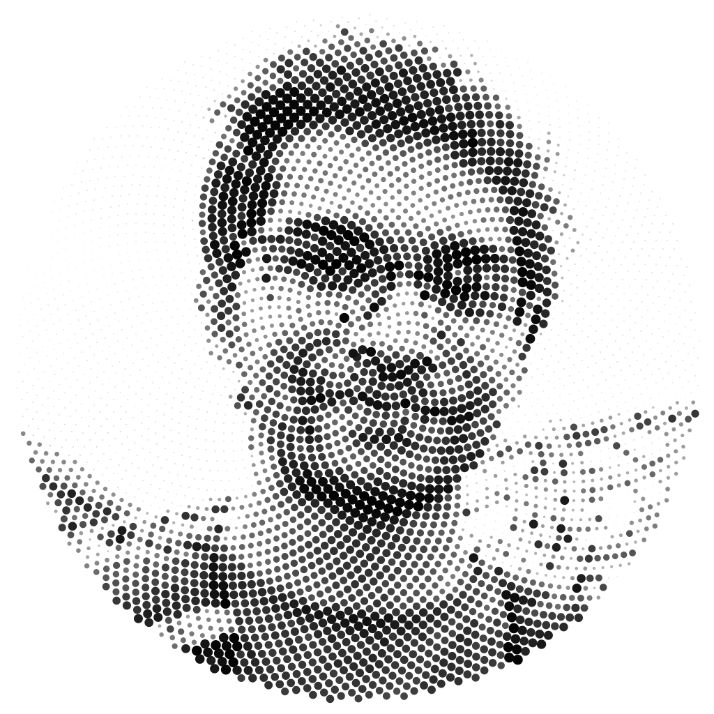

## [](https://github.com/avinal/Golden-Ratio-Image/blob/master/LICENSE)

# Golden-Ratio-Image
Converts a image to a grayscale/color Fibonacci Number based Golden Ratio Image. 

*Use Squared-Cropped Image for best Results.*

# How to Compile
```
git clone https://github.com/avinal/Golden-Ratio-Image.git
cd Golden-Ratio-Image
javac src/*.java
java src.TreeDraw
```

## Image Examples
 1. Actual Image
    

 2. Artistic Image
    

his Project uses `StdDraw.java`. The Same can be obtained from [here](https://introcs.cs.princeton.edu/java/stdlib/StdDraw.java.html).


